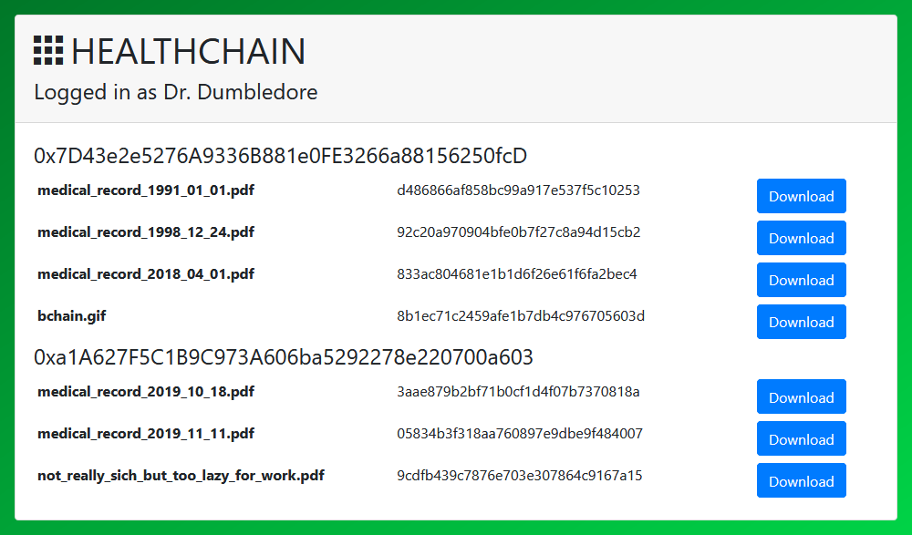

# Healthchain

Store your medical records in a blockchain and give doctors permissions when they need it :hospital:

### :warning: :warning: :warning:
This projects is a proof of concept and by no means ready to use in real world use cases. Deploying the smart contract on the real ethereum network might result in high costs!

## About

### Patient's view

A patient can log in to the web-app and upload his medical records.
A list of all uploaded documents is displayed. The documents can be downloaded or deleted. After a medical record document is uploaded, the patient can give a doctor access to his documents. As soon as the Doctor doesn't need access anymore, the permissions can be revoked.


### Doctor's view

A doctor sees all documents that he has access to. Document can be downloaded to view them.



## Setup development environment

1. Install Ganche from the [official webpage](https://www.trufflesuite.com/ganache) or the latest [release on github](https://github.com/trufflesuite/ganache/releases).
2. run `npm install truffle -g` to install truffle globally
3. [Windows] If you don't have Visual Studio installed, run `npm install --global --production windows-build-tools`

## Building the smart contract

1. Start Ganache and create a new workspace (quickstart). Make sure the RPC server is set to 127.0.0.1:7545.
2. in the root of this repository, run:
```bash
truffle compile
truffle migrate
```
3. Copy the smart contract to the server:
```
copy-contracts-to-server.ps1
```
By default the smart contract is deployed to the client. Truffle can't deploy to multiple directories.

## Client

A website for patients and doctors to store, view and manage medical records.

Start the react app:
```
cd client
npm start
```

## Server
Files are uploaded to the server. The server can access the blockchain to check if a user is allowed to download the requested file.

Start the nodejs server:
```
cd server
npm start
```

## testimonials

This project is based on the react truffle box: https://www.trufflesuite.com/boxes/react
